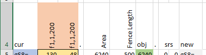
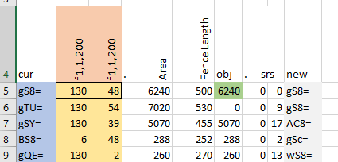

# ganesha-xl
Genetic Algorithm optimization plugin for Excel

This project provides an Excel interface to a simple Genetic Algorithm (maximize) implemented in a C# plugin. The test/ folder shows some
 optimization problems that can be solved with the plugin. **Please keep in mind that this plugin is a work-in-progress and may
 not be fit or suitable for any purpose.**

I'd like to think there are some novelties with this plugin:

* Population data is stored as strings in cells in base64 format. Operations for selection and crossover use and produce the base64 format.
* A schema and parse routine is used to convert from the binary base64 format into a format needed by an objective function.
* An objective function can be written with any Excel function, VBA script or other plugin.
* Population sampling uses a hybrid method that uses both objective-value and data-crc to remove population duplicates and reduce saturation.

To iterate properly through the generations about 20 lines of VBA glue is required. That code won't be discussed here. When building the plugin it is
 also digitally signed using windows powershell's `New-SelfSignedCertificate` function so enable testing and development without having to fool
 around with Excel's global trust settings. Setting powershell up to work properly and getting the root cert installed won't be discussed here
 either (but have a look in the cert/ folder for some links). The discussion here is mainly about how the C# plugin works with Excel.

## Problem Design

To use this plugin, you need to design your optimization problem by thinking about how you can most effectively compact the variable-space of
 your objective function. Compacting the variable-space is probably thought of as constraint-design, but I'll go out on a limb and suggest
 it's more than that - it's more like working with the problem-structure because the goal is to reduce the search space. GaneshaXl GA
 doesn't really have constraints per-se.

Problem-structure is defined using a problem schema. **You** write the schema for your problem. The schema specifies how many variables are
 in your problem and what kind they are such that the plugin is able to calculate how big your solutionspace is (in bits). The schema is used
 to extract values for your variables from the population data and use in your objective function logic (probably just about anything you can
 do with Excel). Population data is stored in base64, but you don't really need to work with those values directly - its only a storage format
 for the routines in the plugin.

Your objective function should use the values parsed from the population data and produce values `>=0` only, **no negative values!** The GA only solves
maximization problems, so if you're trying to solve a minimization problem you'll need to change your objective. Discontinuities in the objective
 function appear to be fine as long as the solution space is not vastly larger than the population size - to make changes to the population sizes
 be mindful that the plugin uses *array formulas* which can be tricky to resize.

## Sampling and Crossover Generalities

The plugin's selection sampling routine (gxSample) uses a hybrid approach of objective-value and data-crc to remove population duplicates and
 reduce saturation. It also tracks the two best *unique* population members and ensure that 1/3 of the total population is given to cross breeding
just those members with other viable candidates. They are also bred with themselves (without mutation) resulting in effectively a plain copy - to
 ensure they are preserved and not removed from the population accidentally.

gxSample produces two columns indicies for use by the breeding (gxCross) but as these are output to sheet cells, you are welcome to interfere
with the values before passing them on to gxCross. Either that or you can write your own or hack on gxSample itself.

## Schema

The schema is contained in text cells - either plain text or as a result of an Excel function like string concatenation. It's a fixed format
 that has a simple hand-built parser.

| Schema | Description |
| --- | --- |
| `n` | nil field. Skipped during bit extraction. |
| `b,<bitlength>` | positive integer field. Specified by a specific number of bits during extraction. |
| `f,<offset>,<stepsize>,<stepcount>` | a floating point number discretized by `<stepsize>` with a minimum of `<offset>`. The number of bits required for the number is determined simply by something  like round(log2(`<stepcount>`)). |
| `p,<n>,<k>,<group>,<pick>` | a `<pick>` from `<k>` of the permutation `<n>P<k>`. `<group>` is used to distinguish between multiple permute groups in the same schema. The number of bits extracted is determined from an estimate of the LogGamma function - determined in the code by Ramanujan's approximation.  |

The permutation field is very structural to a problem. It may be useful to extend the schema to support other kinds of structural
 fields. Some that come to mind include:

* a way to specify and extract the solution-terms of a Partial Sum Problem. A Partial Sum Problem might be useful to describe equality constraints on
  problems with network continuity - like supply/demand space-problems or storage fill/drain time-problems.
* ?

## API

To reduce calculation overhead the api is designed to return array values (except for gxPerm).

| Function | Description |
| --- | ---|
| gxRandom( schemaHRange, outputRows ) | schemaHRange is the row-range for the problem schema. outputRows specifies the size of the array of randomly generated population data. Returns a vertical array of the random data. |
| gxParse( schemaHRange, inputVRange ) | schemaHRange is the row-range for the problem schema. inputVRange specifies the base64 encoded population data that should be decoded with the specified schema. Returns a rectangular array of the parsed data. |
| gxSample( inputVRange, objVRange ) | inputVRange specifies the base64 encoded population data. objVRange specifies the cells containing the results of evaluating the decoded (parsed) data with an excel-written objective function. Returns a 2 column array containing the row matchings for gxCrossover. |
| gxCross( inputVRange, sampleidxVRange, optMutValue ) | inputVRange specifies the base64 encoded population data. sampleidxVRange specifies the indicies used for crossover. optMutValue is an optional value for the mutation rate, which is normally set to 10%. Returns a vertical array of crossed and mutated population data in base64 format. |
| gxPerm( n, k ) | returns the estimated number of bits needed to represent a Factoradic coding of `nPk`. |

## Quick Tour

As an example, the schema is typically laid out in a top row of a sheet. Here, column cur is the current (input) population data and the
 columns `f1,1,200` correspond to fields that are extracted as floats in the range of `[1,200]` in steps of `1.0`. The Area and
 Fence length columns are calculated from the extracted variables for the example problem. The obj column is the value of the
 objective function (really just area, as long as the Fence Length is `<= 500`). The srs column is the output from gxSample and
 contains the indicies for rebreeding. The new column is the result of gxCross with the srs columns. When iterating, the VBA
 glue copies the new column into the cur column and evaluation continues again.

Below the schema is the start of the population data (on the left). The best population member is always positioned as the first (0th) population
 member.  For the first 1/6 of the population the left srs column shows 0, to force breeding with this 0th member.

In this example, green-colored objective-value cells are cells in the top 10% of all objective-values. This has been done just as
 a debugging aide.

At the position of the second 1/6 member (row 18) is the second best member. It also is also force-bred with 1/6 of the population.

The second 1/3 of the population is just free-bred with any other member.

The last 1/3 of the population is given to random member generation using gxRandom (shown starting here in row 66). The objective function is evaluated for these members
 and they can be selected to bred with other members but there is no 'feedback' in the generation of these member data - which is why
 the new column ends prior to this section of the population.

Future investigation might discover strategies that can provide useful bias to the randomness of the member data in this last
 section. Some considerations might include:

* using Bayesian Analysis for schema-specific permutation
* ?

